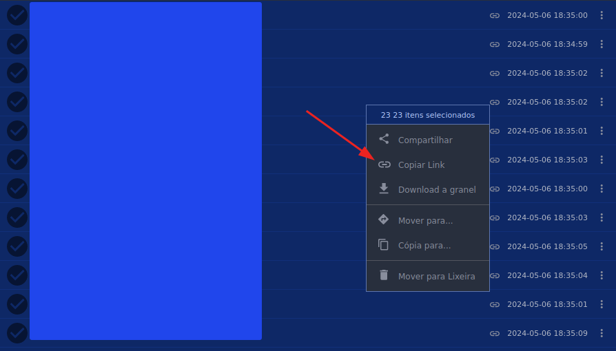

### Mediafire extractor

> Script que realiza uma varredura em links compartilhados do MediaFire, separando-os e salvando-os em um arquivo de texto.
---
### Exemplo

**1. Selecionando os links no MediaFire**

- Em seu MediaFire, selecione todos os arquivos desejados com o mouse ou usando `Ctrl+A` para todos
- Clique em `copiar link`

</img>

**2. Executando o script**
- Clone o repositório
```
git clone https://github.com/aglairvta/mediafire-extractor.git
```

- Abra a diretório onde realizou o clone
```
cd mediafire-extractor
```
- Execute o codigo python
```
python extractor.py
```
- O terminal irá solicitar o link compartilhado do mediafire, cole-o e aperte `Enter`

**3. Resultado**

- Será criado um arquivo chamado `links.txt` onde conterá os links individuais do grupo compartilhado

